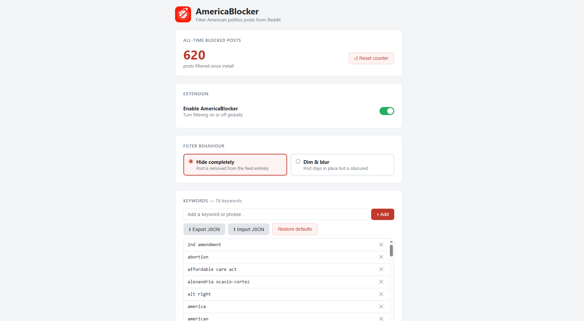
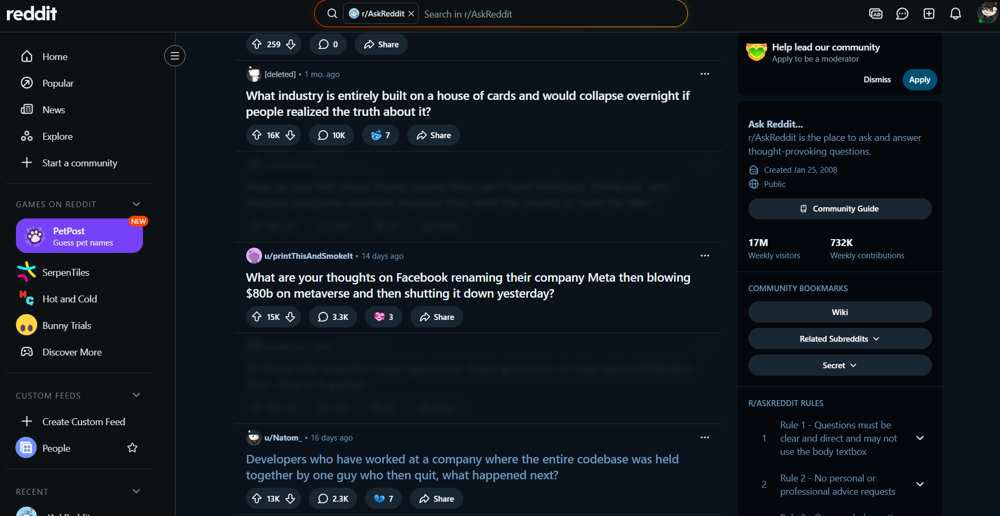
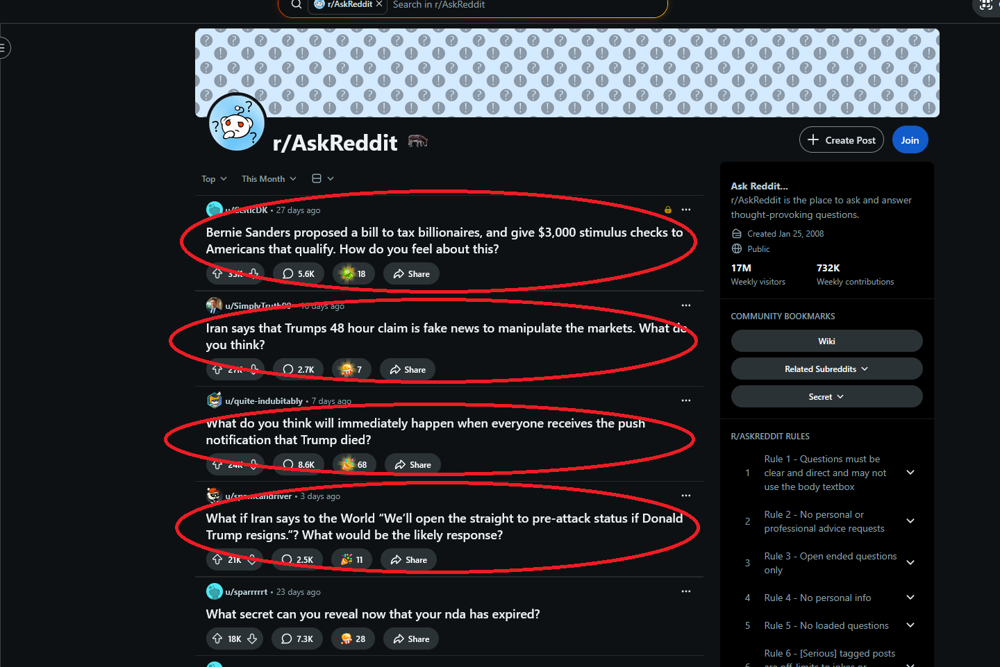
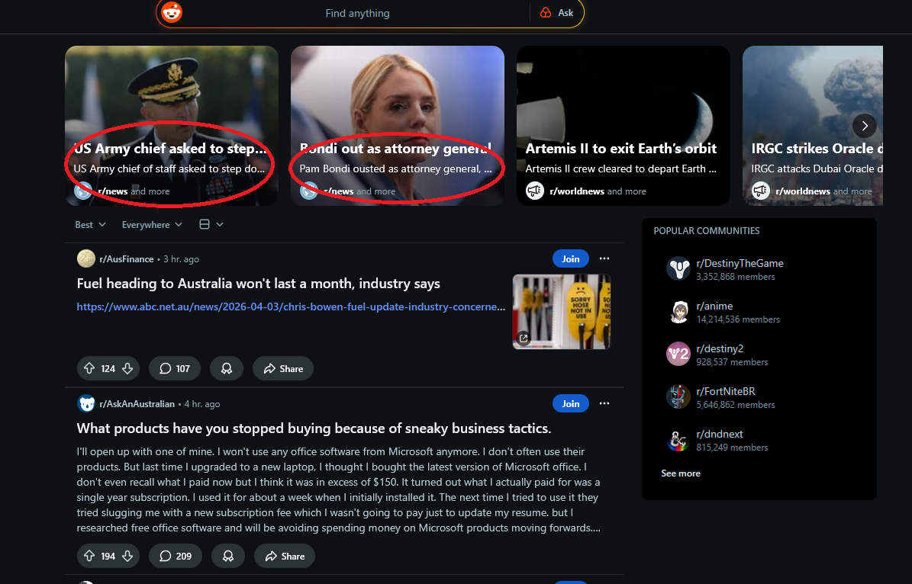
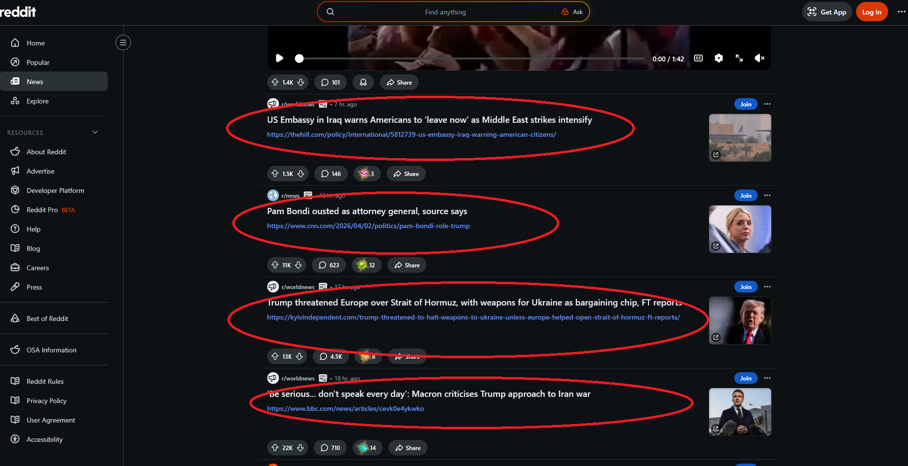

# Reddit-AmericaBlocker

Filter American politics content from Reddit.

**AmericaBlocker** is a Chrome + Firefox (MV3) extension that hides or dims Reddit posts (and other UI surfaces like search results, search dropdown suggestions, and the Popular carousel) when they match an editable keyword list. It also keeps a running count of how many items were filtered.

## Screenshots

### Options page (keywords + counter + mode)

### Dim & blur mode in-feed

### Feed filtering (posts removed/dimmed)

### Popular carousel filtering

### Search results filtering (includes preview snippets)

## Features

- **Editable keywords**: Add/remove keywords and phrases from the options page.
- **Two block modes**:
  - **Hide completely**: removes matched items from the page.
  - **Dim & blur**: keeps items in place but obscures them.
- **Covers multiple Reddit surfaces**:
  - Main feed posts
  - Community highlights carousel
  - Search results (including the media grid)
  - Search dropdown suggestions (including inside the search bar’s shadow DOM)
  - Popular page carousel tiles (dims/hides both overlay and image)
  - “Recent Posts” sidebar module
- **All-time counter**: persistent “blocked items” total with a reset button.
- **Case-sensitive `US`**: `US` matches only uppercase `US` (not the pronoun “us”).

## Install (developer / unpacked)

### Chrome / Edge

1. Open `chrome://extensions`
2. Enable **Developer mode**
3. Click **Load unpacked**
4. Select this folder: `AmericaBlocker/`

### Firefox (MV3)

1. Open `about:debugging#/runtime/this-firefox`
2. Click **Load Temporary Add-on…**
3. Select `manifest.json` in this folder

## Usage

- Click the extension icon → it opens the **settings** page.
- Add keywords and choose **Hide completely** vs **Dim & blur**.
- The badge shows a running total (stored locally), and the options page shows the all-time count with a reset button.

## Development notes

- **Settings storage**:
  - `chrome.storage.sync`: keywords, enabled, hide/dim mode
  - `chrome.storage.local`: blocked counter
- **Core filtering**: `content/reddit-filter.js`
- **Options UI**: `options/options.html` + `options/options.js`
- **Badge/counter**: `background/service_worker.js`

